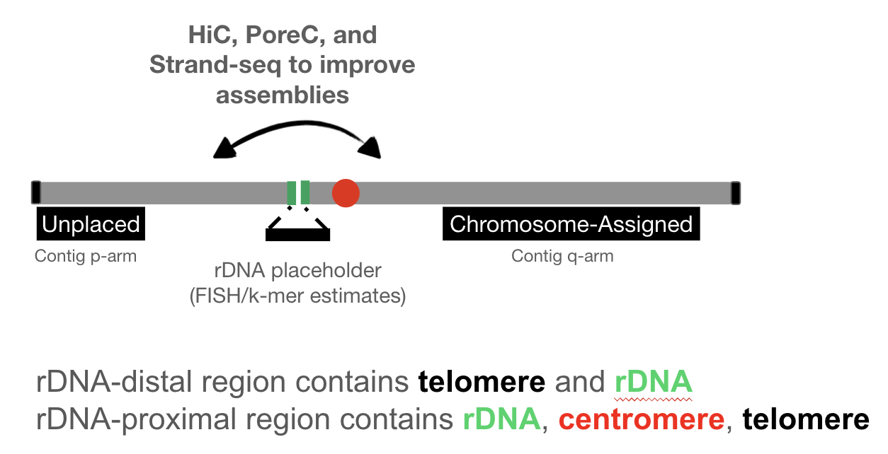

# Scaffolding of human acrocentric chromosomes

In an effort to assemble full diploid human genomes, [Verkko](https://github.com/marbl/verkko) is a great choice for datasets including both accurate and long reads, such as those that include HiFi/Duplex reads, and ONT-UL reads. 

In order to phase these assemblies, typical choices include the use of parental k-mers, Hi-C, or Strand-Seq data. Recently, [poreC](https://www.biorxiv.org/content/10.1101/2023.02.21.529152v1) reads have been suggested as an alternative to these methods in order to phase diploid human genomes.  

In this work, we explore the potential of poreC reads to scaffold rDNA-distal and rDNA-proximal junctions of acrocentric chromosomes. 




This work includes three steps:

### Identifying contigs/scaffolds from acrocentric chromosomes
Ideally, all contigs/scaffolds from an assembly would be assigned into either of the haplotypes in a diploid genome. This is not always the case for acrocentric chromosomes. 

rDNA-distal sequences are large (from ~40Mb to >100 Mb), contain rDNA array, centromere, telomere, and confidently map to either chromosome 13, 14, 15, 21 or 22 (e.g. using CHM13 as a reference and mashmap). 

rDNA-proximal sequences are small (from ~2.5Mb to ~5Mb), and contain telomere and rDNA array. These sequences cannot be confidently assigned to chromosome 13, 14, 15, 21 or 22, and it would be advisable not to try to do so based on sequence similarity due to their very high satellite content.  

Ideally, one would identify all the sequences from acrocentric chromosomes using sequence features described in this paragraph. For rDNA and centromeres, one might use workflows maintained by Hailey Loucks from Miga lab (hloucks@ucsc.edu). For telomeres, one might use [seqtk telo](https://github.com/lh3/seqtk) command.

### Mapping poreC reads
In this step, we are mapping poreC reads using minimap2 and filtering for the mapping quality 10, which seems to represent a good compromise between the quality of mapping and the number mapped reads. In poreC, a single read will carry sequences from potentially distant sequences in the linear space that are in close proximity in 3D chromatin structure. Unlike Hi-C reads -- that always have a single pair of sequences -- poreC will contain multiple concatemers. In the current implementation, we are converting these multi-contacts into pairwise contacts, altough incorporating multi-contact information could improve the performance. For example, a single poreC read carrying sequences A, B, C will be treated as three interactions: A-B, B-C, and C-A.  

To get the information about these interactions, run the following:
```
./run_poreC_minimap2.sh reference porec_file

for example:
sbatch run_poreC_minimap2.sh PAN027.diploid.complete.fa PAN027.poreC.fastq.gz
```

### Visualizing poreC interactions
This script will require the table of interactions from the previous step, as well as identified rDNA-distal (containing p-arms) and rDNA-proximal (containing q-arms) sequences

Please manually modify the contig names in the script, as well as the input file, and then run the following:

```
Rscript plot_poreC_interactions.R
```

The resulting heatmap should provide an information needed for the scaffolding of acrocentric chromosomes. 

In terms of normalization (since various contigs will have various lengths and thus the number of poreC reads/contacts), we look up all contacts for a specific p-arm containing contig, and use mean of this numerical vector. For each candidate q-arm containing contig, we calculate qcontacts/mean_across_all. This is the number the heatmap shows.

This workflow was tested on the verkko assembly of PAN027 individual, and the poreC assignments matched the assignments from Hi-C reads. We believe that poreC represents a viable scaffolding alternative to traditional scaffolding methods. 


